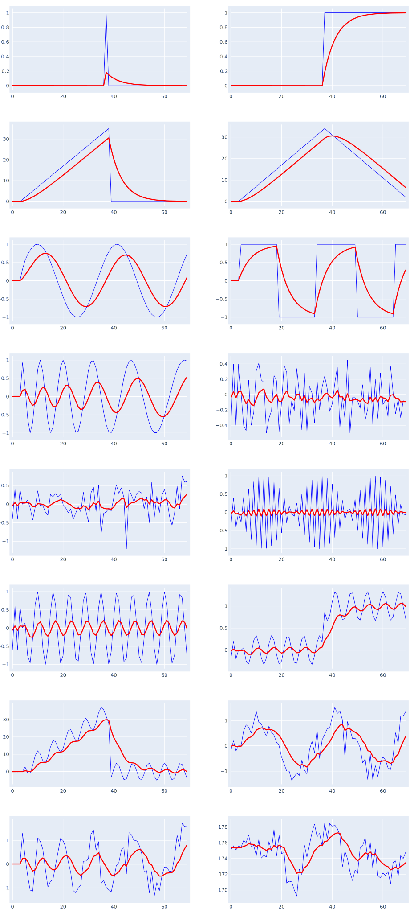

# EMA: Exponential Moving Average
period = 10



EMA needs very short history buffer and calculates the EMA value using just the previous EMA value. The weight of the new datapoint (k) is k = 2 / (period-1)

## Calculation

There is an adopted practice to calculate $SMA$ when $n < period$.

$$
EMA_n = \left\{ \begin{array}{cl}
\frac{1}{p}\left( data_{n}-data_{n-p}\right)+SMA_{n-1} & : \ n \leq period \\
{k}\times ({data_{n}} - EMA_{n-1}) + EMA_{n-1} & : \ x > period
\end{array} \right.
$$


## Reference Calculation
period = 5
```
TSeries data = new() {81.59, 81.06, 82.87, 83.00, 83.61, 83.15, 82.84, 83.99, 84.55, 84.36, 85.53, 86.54, 86.89, 87.77, 87.29};
EMA_Series ema = new(data, 5, useNaN: false);
EMA_Series ema_nan = new(data, 5, useNaN: true);
for (int i=0; i< data.Count; i++)
    Console.WriteLine($"{i}\t{data[i].v,7:f2}\t{ema_nan[i].v,7:f3}\t{ema[i].v,7:f3}");
```
|#|input|ema_NaN|ema|
|--|:--:|:--:|:--:|
|0|  81.59|    NaN| 81.590|
|1|  81.06|    NaN| 81.325|
|2|  82.87|    NaN| 81.840|
|3|  83.00|    NaN| 82.130|
|4|  83.61| 82.426| 82.426|
|5|  83.15| 82.667| 82.667|
|6|  82.84| 82.725| 82.725|
|7|  83.99| 83.147| 83.147|
|8|  84.55| 83.614| 83.614|
|9|  84.36| 83.863| 83.863|
|10|  85.53| 84.419| 84.419|
|11|  86.54| 85.126| 85.126|
|12|  86.89| 85.714| 85.714|
|13|  87.77| 86.399| 86.399|
|14|  87.29| 86.696| 86.696|
## References

- https://en.wikipedia.org/wiki/Exponential_smoothing