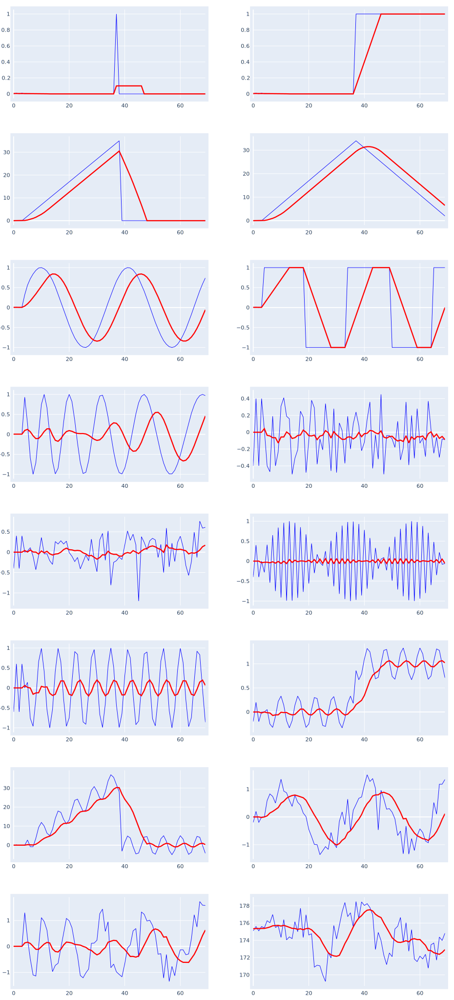

# SMA: Simple Moving Average

period = 10



SMA is is an arithmetic moving average where the weights in SMA are **equally** distributed across the given period, resulting in a mean() of the data within the period.

## Calculation

SMA is a rolling calculation that is looking backwards from the position ${n}$ and is denoted as ${SMA}_{p}{(data)}$ where $p$ represents the period and $data$ represents the list of data points:
$$
SMA_p{(data)} = \frac{1}{p}\sum_{i=n-p+1}^{n} data_i
$$
When calculating the value of the next $SMA_{p,next}$ while knowing all previous SMA values, SMA calculation can be reduced to:
$$
SMA_{p,next} = SMA_{p,prev}+\frac{1}{p}\left( data_{n+1}-data_{n+1-p}\right)
$$

## Reference Calculation
period = 5
```
TSeries data = new() {81.59, 81.06, 82.87, 83.00, 83.61, 83.15, 82.84, 83.99, 84.55, 84.36, 85.53, 86.54, 86.89, 87.77, 87.29};
SMA_Series sma = new(data, 5, useNaN: false);
SMA_Series sma_nan = new(data, 5, useNaN: true);
for (int i=0; i< data.Count; i++)
    Console.WriteLine($"{i}\t{data[i].v,7:f2}\t{sma_nan[i].v,7:f3}\t{sma[i].v,7:f3}");
```

|#|input|sma_NaN|sma|
|--|:--:|:--:|:--:|
|0|  81.59|    NaN| 81.590|
|1|  81.06|    NaN| 81.325|
|2|  82.87|    NaN| 81.840|
|3|  83.00|    NaN| 82.130|
|4|  83.61| 82.426| 82.426|
|5|  83.15| 82.738| 82.738|
|6|  82.84| 83.094| 83.094|
|7|  83.99| 83.318| 83.318|
|8|  84.55| 83.628| 83.628|
|9|  84.36| 83.778| 83.778|
|10|  85.53| 84.254| 84.254|
|11|  86.54| 84.994| 84.994|
|12|  86.89| 85.574| 85.574|
|13|  87.77| 86.218| 86.218|
|14|  87.29| 86.804| 86.804|

## References
   - https://en.wikipedia.org/wiki/Moving_average#Simple_moving_average
   - Kaufman, Perry J. (2013) Trading Systems and Methods
   - Murphy, J. (1999) Technical Analysis of the Financial Markets